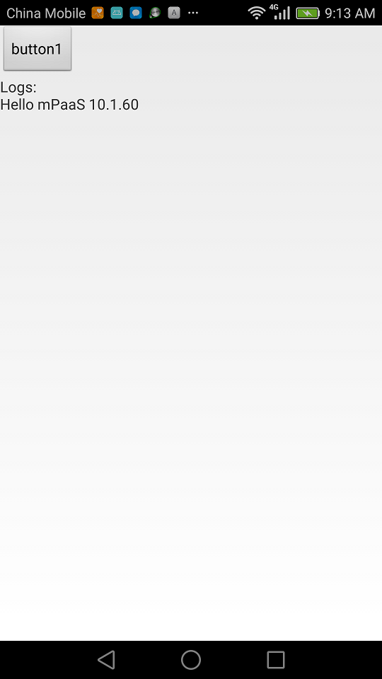
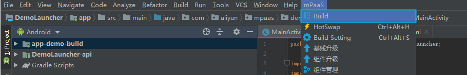
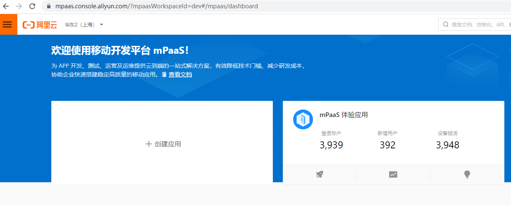
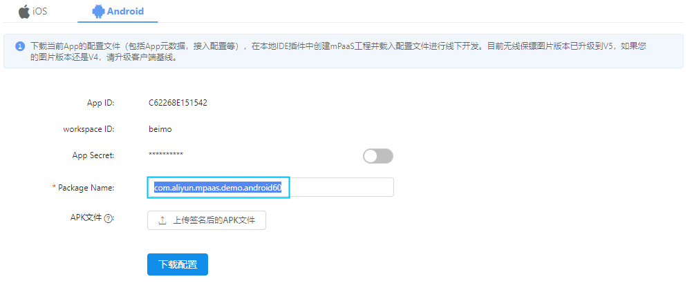
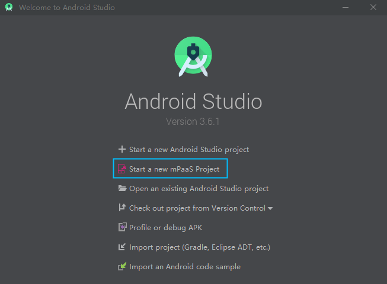
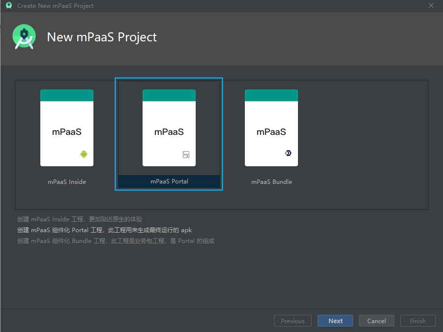
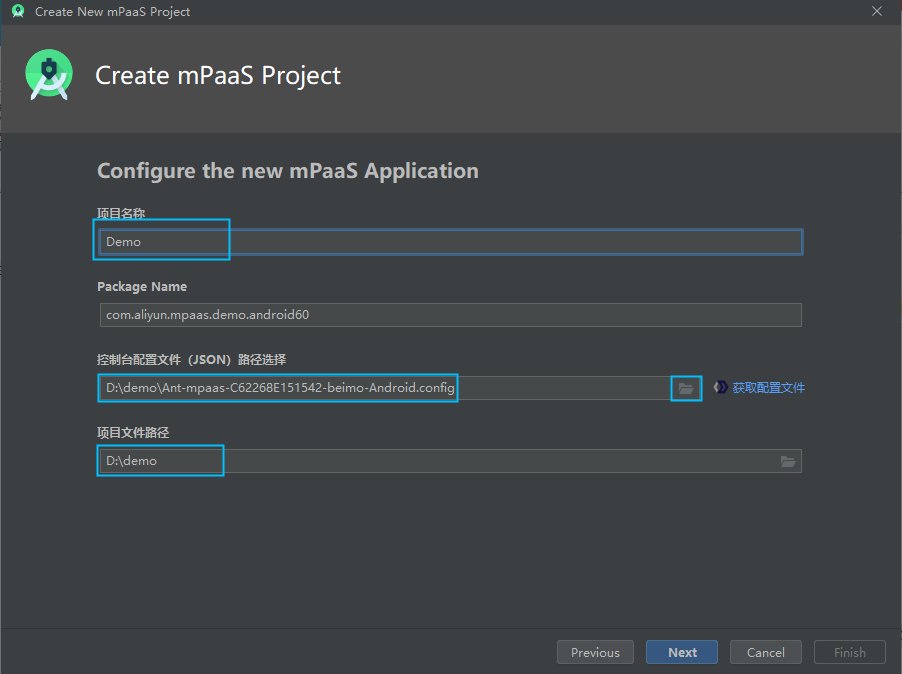
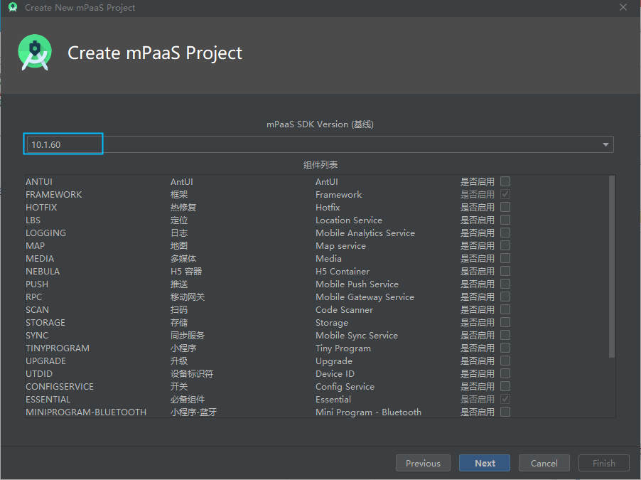
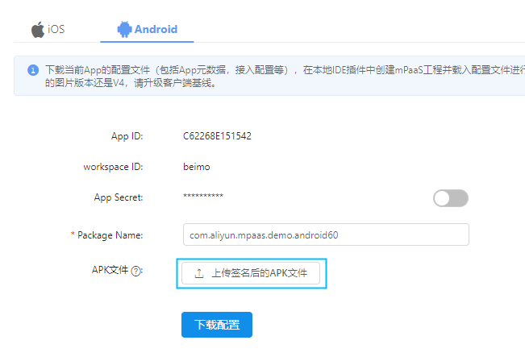

# mPaaS_Framework_HelloWorld

## 描述

本 Demo 主要演示一个基于 mPaaS 框架、但是不含任何 mPaaS 具体功能和业务逻辑的 mPaaS Android 应用。 相当于原生 Android 开发中，通过 Android Studio 创建新应用后直接编译运行的效果。

> 本 Demo 的意义在于：
> 
> 通过本 Demo 及其 Readme.md， 我们将详细介绍 mPaaS 框架的接入方式。
> 同时，其它 Demo 均基于本 Helloworld 编写。因此，如您需要详细了解那些 Demo 中涉及哪些代码修改，您可以将该 Demo 工程文件夹于本 Demo 工程文件夹通过文本比对工具进行比对，并通过比对结果获取直观的信息。

## 运行结果：

应用成功打开即可视 为 Demo 展示完成。
此外，点击 button1 后，APP 打印出一行字符串 Hello mPaaS 10.1.60

## 操作步骤

**说明：**本操作步骤部分仅展示本Demo代码下载后如何编译执行。关于从零开始的mPaaS框架接入，请参考下文"mPaaS接入"章节

### 一、确保 Android Studio mPaaS 开发插件已安装

关于 mPaaS 开发插件的安装，可参考下文"mPaaS 接入"章节中"mPaaS 插件安装"部分。
 
### 二、编译 Bundle 工程

   1.通过 Android Studio 打开 mPaaS_Framework_HelloWorld\DemoLauncher；

   2.点击 Android Studio 主菜单-> mPaaS -> Build 编译。

### 三、编译和运行 Portal 工程

   1.通过 Android Studio 打开 mPaaS_Framework_HelloWorld\Demo；

   2.点击 Android Studio 主菜单-> Run -> Run 'Demo-app'编译和运行。

## 代码简介

- **关于portal工程和bundle工程**

	不同于纯原生 Android 开发，在 mPaaS「Portal+Bundle」模式中，mPaaS 基于 OSGi（Open Service Gateway Initiative，开放服务网关倡议）理念，将一个 App 划分成各自独立的一个或多个 Bundle 工程，及一个用于将这些 Bundle 汇总编译为 APK 的 Portal 工程。通常，Bundle 负责业务的具体实现；Portal 负责承载一些全局性的配置信息，例如 APK 签名配置、云端服务相关配置、AndroidManifest 等等。
	
	在 ‘HelloWorldDemo’ 及其他 Demo 库中，因为业务逻辑非常少，我们采取了 1 个 Portal+1 个 Bundle 的结构。 在实际应用开发中，可以视具体情况决定是否采用 1 个 Portal+ 多个 Bundle 的模式。 
	
	> 通常，如果业务功能相对简约单一，开发团队规模较小，往往采取单 Bundle 模式开发；而如果一款 APP 包含多个模块，且业务之间没有很强耦合关系（如支付宝内的借呗和蚂蚁森林），同时开发团队规模较大（几十、上百甚至上千），则更需要考虑如何根据业务、团队针对应用拆分为多个 Bundle（对应多个相互独立的 Android 工程），这将更有利于并行开发。
	
	当然，为了解决使用 Portal+Bundle 组件化接入导致引入第三方 SDK 不便捷的问题，我们已推出全新的接入方式 —— mPaaS Inside。mPaaS Inside 的接入方式与原生工程 AAR 的接入方式几乎一致，同时不影响开发者调用 mPaaS 提供的能力，更适合小项目快速接入、启动的需求，降低接入成本，让开发者能够更轻松使用 mPaaS。后续，我们也将在新的 Demo 库系列中，输出基于 mPaaS Inside 的接入源码示例。
	
	- [进一步了解 mPaaS Inside](https://help.aliyun.com/document_detail/130177.html)
	- [升级 Inside 为 AAR 接入方式](https://help.aliyun.com/document_detail/157038.html)
	

- **关于DemoLauncher中的MainActivity类**

	Demo 入口界面。 该页面上放置了一个按钮(Button1)，其点击后的逻辑在函数 MainActrivity.button1Clicked() 中， 这也是 mPaaS Demo 库中 Demo 的默认标准交互（实在不适用该交互方式的除外）。 所以，在后续其它 Demo 中，如不加特殊说明，您可以在运行后直接点击 button1 观察 Demo 效果。

- **关于Util类**

	Util 类不是框架默认生成，也不是 mPaaS 框架必需。 它只是 Demo 作者所编写。 
	
	本系列 Demo 的宗旨是用尽可能少量的代码向读者展示如何实现 Demo 中所要展示的功能，我们不希望非核心代码占据主展示区(MainActivity class)过多代码篇幅。 因此，作者会将这些非核心但又必须实现的代码封装在 Util 中，以使得主展示区代码尽量聚焦于功能本身。
	
	例如，对于"在 logcat 中打印出一行日志的同时，在页面上也打印出一行日志"这样的辅助性逻辑，我们将它封装于 Util.log() 函数中。

- **关于DemoLauncher中的MockLauncherApplicationAgent类和MockLauncherActivityAgent类**

	阿里云 mPaaS 官方文档中，在"接入 Android "章节下，通过" [加载框架与定制](https://help.aliyun.com/document_detail/51736.html) " 做了详细阐述。可在实际需要时参考。本 Demo 库中绝大多数 Demo 不涉及到这两个类，因此本文档中不作详细描述。
	
- **其它注意事项**
	
	本系列 Demo 的主旨是用最简化代码向读者展示一个 mPaaS 功能的实现方式，以便于读者直观了解最核心的代码实现。 因此，在代码编写的过程中，不考虑性能、错误冗余、代码风格等因素。请读者在 Demo 使用的过程中留意。
	
	如读者需要最佳实践相关的示例代码, 请参考阿里云 mPaaS 官方文档中提供的官方 Demo。

## mPaaS 接入

本节详细介绍如何从零开始接入 mPaaS，并创建本 Helloworld.  因为本 Demo 系列中其它 Demo 都是基于该 Helloworld 工程，在其它 Demo 中将不再赘述详细接入细节。

### 一、配置开发环境

参考阿里云 mPaaS 官方文档 "接入 Android"章节中" [配置开发环境](https://help.aliyun.com/document_detail/51724.html)  " 完成开发环境配置。

### 二、创建云端mPaaS应用

##### 1. 登录阿里云总控制台，并进入 [mPaaS 移动开发平台控制台](https://mpaas.console.aliyun.com) 。

> 如您未开通阿里云或阿里云 mPaaS，您可以通过 [阿里云官网](https://www.aliyun.com) 完成mPaaS 产品开通。 

##### 2. 创建应用

点击以上 mPaaS 控制台页面"+ 创建应用"，输入应用名称，并点击确定。 

> 本Demo 中起名为 com_aliyun_mpaas_demo_10.1.60. 实际生产中可以起更有意义的名字，如 APP 名称。

##### 3. 下载 mPaaS App 配置文件

进入所创建的应用(com_aliyun_mpaas_demo_10.1.60)，代码管理->代码配置，进入 Android 页，输入应用的全局包名后，点击下载配置按钮，下载应用配置文件(.config文件)。 

> 本 Demo 中输入为 com.aliyun.mpaas.demo.android60

##### 4. 创建 mPaaS Android 工程

###### 打开已成功安装 mPaaS 开发插件的 Android Stuido, 点击 Start a new mPaaS Project

###### 选择 mPaaS Portal，Next

###### 设置项目名称、mPaaS 应用配置文件(.config)、项目文件路径。 本 Demo 中设置如下：

其中，

- 项目名称: 对应 Portal 工程的工程名，同时自动创建的 Bundle 名也会被命名为"项目名称+Launcher”，例如 本 Demo 的 DemoLauncher；
- PackageName：可以不用填写，将从配置文件(.config)中读取；
- 控制台配置文件：可在截图中点击文件选择按钮选择步骤 3 中下载的 App 配置文件(.config)；
- 项目文件路径： 项目代码文件所放置的位置。

###### 配置 mPaaS SDK

其中，

- mPaaS SDK Version（基线）：SDK 的大版本号，在 mPaaS 中我们称之为"基线"。 本 Demo 是关于 10.1.60 基线的，所以我们设置为 10.1.60。

- 组件列表：mPaaS 框架的各种功能以组件的形式提供，该列表列出所选基线下具备的功能，供开发人员根据 APP 具体需要选择。 因为本 Helloworld 工程不实质上使用到 mPaaS 提供的任何功能，因此可以所有可选项都不勾选。  在本系列其它具体功能点的 Demo 中，以及实际工程开发中，需根据所使用的功能做相应勾选。

###### 配置 Bundle 信息(Create Bundle Info)

可使用默认配置，并点击 Finish 完成配置。

完成配置后，将自动打开两个 Android Studio 工程，分别为 portal 和 bundle 工程。至此，全新的完整 mPaaS 项目已经创建完成。

### 三、代码编写(可选)

参考下载的 mPaaS_Framework_HelloWorld Demo 中 MainActivity (及相应Layout)和 Util 的代码实现，完成 Helloworld 示例代码。

### 四、编译运行

##### 1、编译 Bundle 工程

 1) 通过 Android Studio 打开 mPaaS_Framework_HelloWorld\DemoLauncher；

 2) 点击 Android Studio 主菜单 -> mPaaS -> Build 编译。

##### 2、编译和运行 Portal 工程

 1) 通过 Android Studio 打开 mPaaS_Framework_HelloWorld\Demo；

 2) 点击 Android Studio 主菜单 -> Run -> Run 'Demo-app' 编译和运行。

### 五、扩展配置 

> 如只是为了运行一个最基础的无实质功能的 mPaaS Helloworld, 此扩展配置是不必要的。 如文初所述，本 Demo 除了用来展 示Helloworld , 也将作为其它所有 Demo 的祖先工程。因此，我们将其它大多数 Demo 中一些共性的必须的配置放在本 Demo 中，以简化其它 Demo 的配置和使用。

1. **应用签名**

	 因默认情况下，不同开发人员的本地 android debug key store 是不一致的，这将导致不同读者 APK 签名不一致。而 mPaaS 中一些功能会依赖于应用签名，如果签名变化，将必须对相关配置做重新设定。 为避免这类麻烦，简化 Demo 的使用，我们在本 Helloworld Demo （即其它 Demo 的祖先工程）中，将 debug 签名设置为基于固定 key store. （顺带也将 release 签名设置为相同。）
	
	1) 在 Portal 工程的 App 目录中，生成 java key store : mpaasdemo.jks
	
	2) 在 Portal 工程的 app build.gradle 中,对签名配置(signingConfigs) 设置如下：
	
	    signingConfigs {
	        release {
	            keyAlias 'mpaasdemo'
	            keyPassword '111111'
	            storeFile file('mpaasdemo.jks')
	            storePassword '111111'
	        }
	        debug {
	            keyAlias 'mpaasdemo'
	            keyPassword '111111'
	            storeFile file('mpaasdemo.jks')
	            storePassword '111111'
	        }
	    }

2. **配置无线保镖数据**

	无线保镖，是阿里巴巴的移动端安全解决方案。 在 mPaaS 中，我们将无线保镖理解成一个黑盒，它的作用是从一段数据（无线保镖数据）中解译出一段密码，这段密码在 mPaaS 客户端和服务端的一些通讯中做加签验签使用，以确保通讯内容不被篡改。 
	
	上述加签验签工作由 mPaaS 框架底层逻辑完成，业务开发人员不需关注。 只要正确配置了无线保镖数据，并在 mPaaS 控制台开启了验签功能，便自动获取了“设备端-服务端”的防篡改能力。 虽然无线保镖放篡改功能在本 HelloWorld Demo 中没有使用的必要， 但是本 HelloWorld 工程也是其它所有 Demo 的祖先工程，而在其它 Demo 中，无线保镖功能会被频繁使用到。 为了避免在其它 Demo 中各自配置无线保镖的麻烦，我们将该无线保镖配置工作在本祖先 Demo 中完成
	
	上述"无线保镖数据”，存放于应用配置文件 (.config) 的 base64Code 项中。 我们在之前 "下载 mPaaS App 配置文件"步骤中，其实已经下载了 .config 文件。 但是这个文件中是不包含无线保镖数据的。 我们需通过以下步骤，进行包含无线保镖数据(base64Code)的 .config 文件的生成和下载。步骤如下：
	
	1. 确保"1. 应用签名"中的签名设置已完成。
	2. 正常编译出一个.apk文件，该文件可从portal工程的\app\build\outputs\apk\debug\目录中获得。
	3. 再次进入mPaaS控制台->代码管理->代码配置,进入Android页，点击"上传签名后的APK文件"按钮，上传步骤2中的apk
	
	4. 重新下载配置。您将下载到一个.zip压缩包，该压缩包中的.config文件将包含上述无线保镖数据(base64Code).
	5. 将下载的包含无线保镖数据(base64Code)的.config,替换入原工程.
