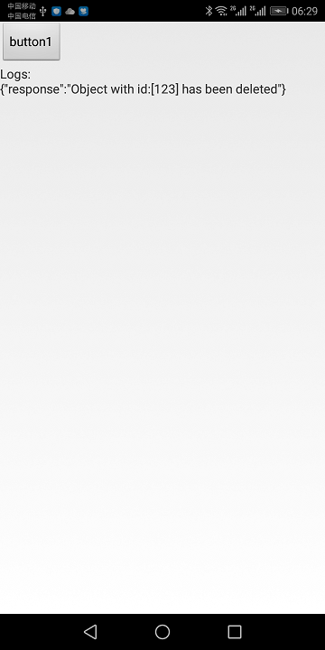
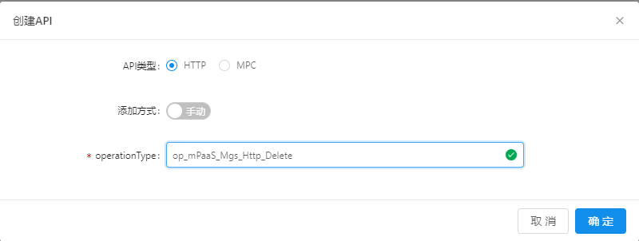
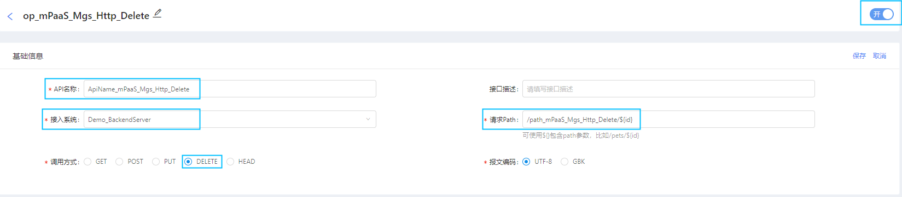
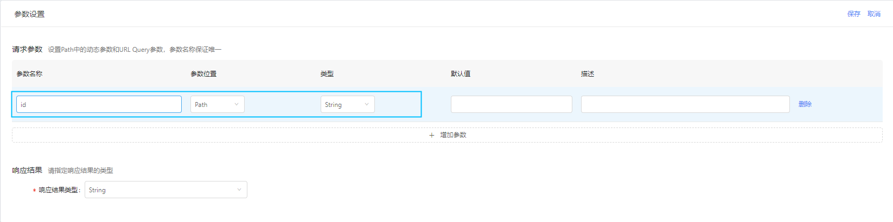

# mPaaS_Mgs_Http_Delete

## 描述
本Demo演示APP如何通过mPaaS移动网关(MGS)访问HTTP方法为Delete的http api接口，通知后端删除对一个id为123的对象实施删除相应操作。

本demo中后端http被调用方式为：

    DELETE http://114.55.252.107/path_mPaaS_Mgs_Http_Delete/123

## 运行结果

点击button1后，APP打印出后端api返回的内容: {"Response":"Object with id:[123] has been deleted"}

## 操作步骤

(因本demo的运行需要与后端配合，但是本demo中使用的是作者阿里云租户下的后端配置，因此，本demo不支持直接编译运行，否则有可能获得错误的结果。您可以参考以下步骤，完成基于您自己租户下的配置，并成功跑通demo全流程)

### 一、后端API服务设置

##### 1.通过IntelliJ IDEA打开Server目录中的springboot工程，经Maven package打包，您将获得jar包 backend_server-1.0-SNAPSHOT-executable.jar

##### 2.在公网可访问的服务器中，运行该jar包启动后端服务。 

    		java -jar backend_server-1.0-SNAPSHOT-executable.jar

  例如本例在一台IP为114.55.252.107的服务器上运行该jar包，则该后端服务通过URL http://114.55.252.107/path_mPaaS_Mgs_Http_Delete对外提供HTTP方法为DELETE的http api服务。
  
### 二、mPaaS控制台配置

##### 1.点击 mPaaS控制台 ->后台服务管理->移动网关->API分组->创建API分组*

以本 Demo中设置为例：

- API分组: 填写API分组的名字。API分组可以理解为提供一系列api的后端服务。例如实际生产中,有一个提供登录服务的后端服务系统，其提供login、logout一些列http api，我们可以在这里填写LoginService,以代表后端用户登录服务系统。本Demo中，后端服务是一个纯技术的不含任何业务属性的服务, 我们对其命名为Demo_BackendServer。

- 服务地址：后端服务的url (不包含具体api路径)。本demo中设置为http://114.55.252.107 

##### 2.点击 mPaaS控制台 ->后台服务管理->移动网关->API管理->创建API

以本 Demo中设置为例：

- operationType: 对operationType命名。 operationType可以理解为一个具体的api接口。例如实际生产中，对于上述提及的后端登录服务系统的一个登录服务，这里可以填写为login或LoginAPI等用于辨识该接口的命名。因本demo不含任何业务属性，我们对后端demo的接口api在这里命名为op_mPaaS_Mgs_Http_Delete。

##### 3.点击 mPaaS控制台 ->后台服务管理->移动网关->API管理->op_mPaaS_Mgs_Http_Delete->基础信息-修改， 

并在修改后保存和打开本api接口

以本 Demo中设置为例：

其中：

- API名称：在实际项目中填写该api接口(operationType)对操作者友好的有意义名称作为api注释，例如“登录”，“查询余额”。 本Demo因不含任何业务属性，填写了ApiName_mPaaS_Mgs_Http_Delete
- 接入系统：选择步骤1中创建的API分组 Demo_BackendServer
- 请求path: 在实际项目中，请求path为后端业务系统实际http api接口的url的路径部分，例如/login , /checkBalance 。 本demo中，后端demo服务提供的api路径为 /path_mPaaS_Mgs_Http_Delete/{id} . 其中，id为该http api的路径内变量 
- 调用方式：后端api的HTTP方法类型。本demo中为DELETE.

##### 4.点击 mPaaS控制台 ->后台服务管理->移动网关->API管理->op_mPaaS_Mgs_Http_Delete->参数设置-修改

因路径种包含变量{id}，需要在接口参数设置种定义该变量，以便后续生成的客户端代码种支持移动端代码种对该变量的操作。如下：

 
- 参数名称： 步骤3种设置的路径内变量的名称. 本Demo中为id.
- 响应结果类型：后端http api返回的结果类型，该结果类型也将由MGS网关透传至客户端并由客户端框架反序列化为可以直接使用的对象。本Demo种因为后端返回的内容以字符串对待，因此使用默认值String.

##### 6.点击 mPaaS控制台 ->后台服务管理->移动网关->API管理->op_mPaaS_Mgs_Http_Delete的更多->生成代码

选择platform，并填写PackageName, 提交后自动下载网关代理类模板代码,以供编写APP代码时使用。

以本 Demo中设置为例：

其中：

- platform: 对于本demo,选择Android
- packageName: 填写本网关代理模板类的包名。本demo中填写为com.aliyun.mpaas.demo.android60.launcher

### 三、移动端代码编写

涉及后端配置，本Demo移动端工程不支持直接编译运行，否则可能会因连接到demo作者租户中的mPaaS应用而得不到预期结果。

本Demo Client目录下的Android客户端工程是基于本Demo库中mPaaS_Framework_HelloWorld工程添加代码而来。 我们建议参考client目录下Android客户端工程代码，基于您自己的mPaaS HelloWorld工程，添加相应代码完成您自己的客户端代码。

与Helloworld工程相比，主要改动文件：

- MainActivity.java
- Demo_backendServerClient.java
- request目录

关于mPaaS Hello World工程的编写，请参考Demo mPaaS_Framework_HelloWorld 及其readme.md

### 四、编译、安装、运行

  编译、安装后，点击button1执行
