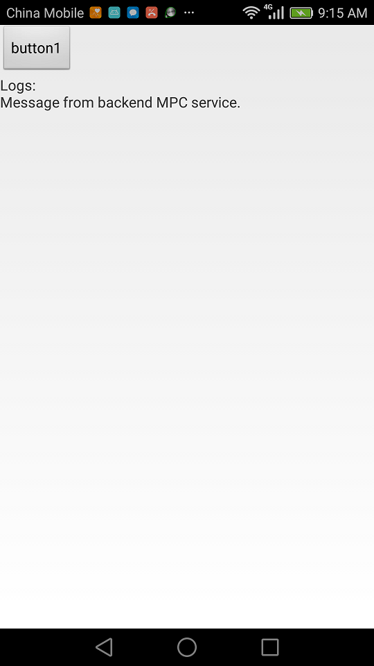
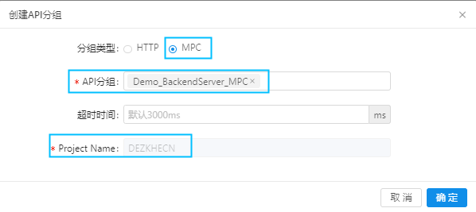
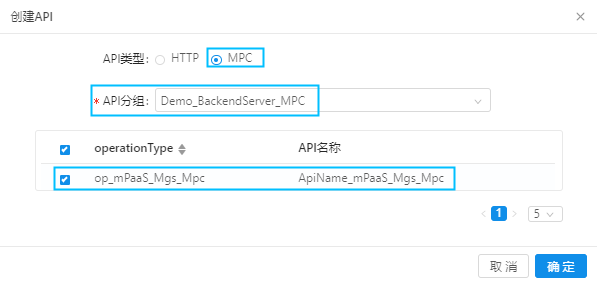

# mPaaS_Mgs_Mpc

## 描述
本Demo演示APP如何通过mPaaS移动网关(MGS)访问后端MPC服务接口，并获得后端服务数据返回。

## 运行结果

点击button1后，APP打印出后端api返回的内容: "Mesage from backend MPC service"

## 操作步骤

(因本demo的运行需要与后端配合，但是本demo中使用的是作者阿里云租户下的后端配置，因此，本demo不支持直接编译运行，否则有可能获得错误的结果。您可以参考以下步骤，完成基于您自己租户下的配置，并成功跑通demo全流程)

### 一、mPaaS控制台配置：配置连接校验密钥和创建API分组

##### 1.创建和配置连接合法性校验RSA密钥对

该密钥对用于本服务与mPaaS建立连接时的合法性校验。

###### 1) 通过openssl依次运行以下命令创建密钥对。

	    openssl genrsa -out private_key.pem 2048
	    openssl pkcs8 -topk8 -inform PEM -outform DER -in private_key.pem -out private_key.der -nocrypt
	    openssl rsa -in private_key.pem -pubout -outform DER -out public_key.der
	    openssl base64 -in private_key.der -out private_key_base64.der
	    openssl base64 -in public_key.der -out public_key_base64.der

###### 2) 配置公钥：

mPaaS控制台->代码管理->接口密钥->RSA2048密钥，填入上述命令生成的public_key_base64.der内容。

*private_key_base64.der请备份，将在后续MPC服务编码中使用。*

##### 2. 创建API分组*

点击 mPaaS控制台 ->后台服务管理->移动网关->API分组->创建API分组

以本 Demo中设置为例：

其中:

- 分组类型: 后端服务的协议类型，本demo中选择MPC
- API分组: 填写API分组的名字。API分组可以理解为提供一系列api的后端服务。例如实际生产中,有一个提供登录服务的后端服务系统，其提供login、logout一些api，我们可以在这里填写LoginService,以代表后端用户登录服务系统。本Demo中，后端服务是一个纯技术的不含任何业务属性的服务, 我们对其命名为Demo_BackendServer_MPC
- Project Name: mPaaS云服务分配的识别名，请记录该值，将会在后续MCP服务编码中使用

### 二、编写和运行后端MPC服务

本demo中，后端MPC服务以springboot应用运行。 与通常的HTTP服务由被动接受网关(MGS)工作模式不同，MPC服务启动后，主动向mPaaS服务注册中心注册服务，并与网关建立长连接以在后续接受MGS的调用，从而一经运行并注册服务成功后即可提供服务，不需向外固定公布其服务接入点(例如http服务的ip、端口)。 

本Demo服务代码在server目录中。

##### 1.服务启动

服务启动方式请参考代码MPCApplication.java

##### 2.服务接口定义和实现

服务接口的定义和实现请参考代码SampleService.java、SampleServiceImpl.java.

##### 3.配置连接合法性校验私钥

将上述生成的private_key_base64.der放在resource/config目录中。

##### 4.配置beans

在resource/META-INF目录下配置Demo_BackendServer_MPC.xml文件，文件内容如下：

		<beans xmlns="http://www.springframework.org/schema/beans"
		   xmlns:xsi="http://www.w3.org/2001/XMLSchema-instance"
		   xsi:schemaLocation="http://www.springframework.org/schema/beans
							   http://www.springframework.org/schema/beans/spring-beans-3.0.xsd">
			<bean id="sampleService" class="com.aliyun.mpaas.demo.SampleServiceImpl"/>
			<bean id="mpcServiceStarter" class="com.alipay.gateway.spi.mpc.MpcServiceStarter">
				<property name="registryUrl" value="116.62.81.246"/>
				<property name="appName" value="Demo_BackendServer_MPC"/>
				<property name="workspaceId" value="beimo"/>
				<property name="projectName" value="DEZKHECN"/>
				<property name="privateKeyPath" value="/config/private_key_base64.der"/>
			</bean>
		</beans>

其中

- id="sampleService"配置业务实现类。 本demo中配置为com.aliyun.mpaas.demo.SampleServiceImpl

- id="mpcServiceStarter"配置MPC服务启动项。

	- registryUrl: 所在云平台注册中心地址，本Demo中配置为所在公有云注册中心地址，固定为116.62.81.246
	- appName: MPC名字，将显示在mPaaS控制台中
	- workspaceId: 对应上述创建分组时所在的mPaaS worksapce ID
	- projectName: 上述创建API分组步骤中给出的 Project Name，
	- privateKeyPath: 上述配置连接合法性校验私钥所指定的private_key_base64.der工程相对地址

##### 5.运行MPC服务

在可以访问到mPaaS云端的机器上运行该MPC服务的springboot应用。

### 三、mPaaS控制台配置：创建和配置API接口

##### 1.点击 mPaaS控制台 ->后台服务管理->移动网关->API管理->创建API

以本 Demo中设置为例：

- API类型: 选择MPC
- API分组: 选择上述创建的api分组 Demo_BackendServer_MPC
- operationType: 如后端MPC服务运行正常，这里将自动弹出MPC服务接口代码中定义的接口，如本demo的op_mPaaS_Mgs_Mpc

##### 2.点击 mPaaS控制台 ->后台服务管理->移动网关->API管理->op_mPaaS_Mgs_Mpc

如接口状态为关闭，开启接口。

##### 3.点击 mPaaS控制台 ->后台服务管理->移动网关->API管理->op_mPaaS_Mgs_Mpc的更多->生成代码

选择platform，并填写PackageName, 提交后自动下载网关代理类模板代码,以供编写APP代码时使用。

以本 Demo中设置为例：

其中：

- platform: 对于本demo,选择Android

- packageName: 填写本网关代理模板类的包名。本demo中填写为com.aliyun.mpaas.demo.android60.launcher

### 四、移动端代码编写

涉及后端配置，本Demo移动端工程不支持直接编译运行，否则可能会因连接到demo作者租户中的mPaaS应用而得不到预期结果。

本Demo Client目录下的Android客户端工程是基于本Demo库中mPaaS_Framework_HelloWorld工程添加代码而来。 我们建议参考client目录下Android客户端工程代码，基于您自己的mPaaS HelloWorld工程，添加相应代码完成您自己的客户端代码。

与Helloworld工程相比，主要改动文件：

- MainActivity.java
- Demo_backendServerClient.java

关于mPaaS Hello World工程的编写，请参考Demo mPaaS_Framework_HelloWorld 及其readme.md

### 五、编译、安装、运行

  编译、安装后，点击button1执行
